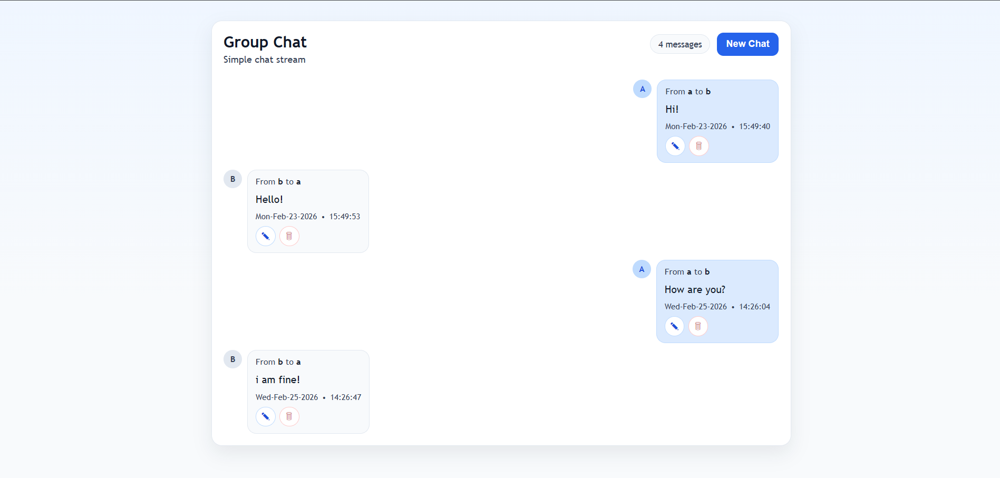
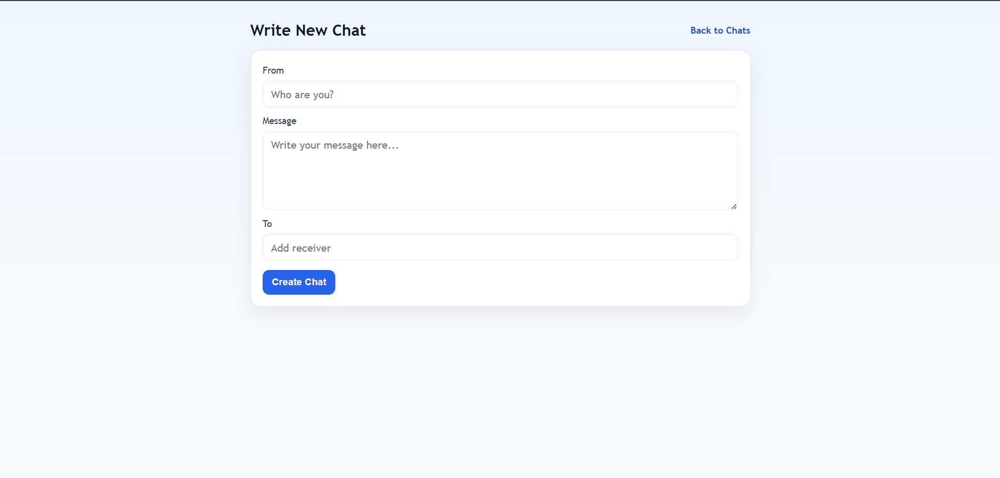
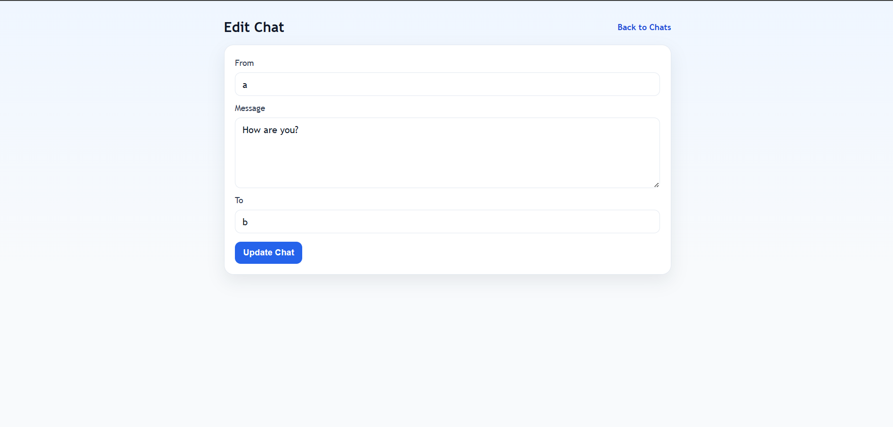
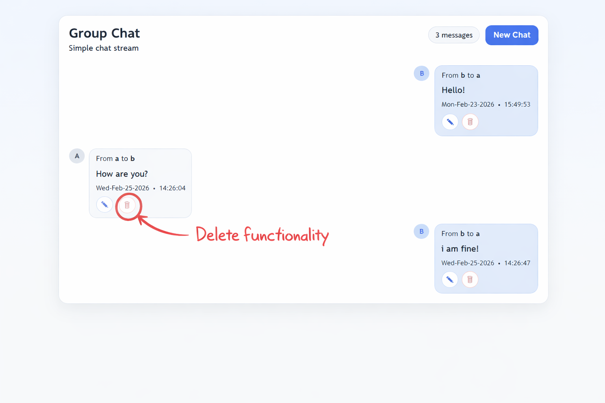

# MongoDB + Express Chat App

A simple CRUD chat app built with **Node.js**, **Express**, **MongoDB (Mongoose)**, and **EJS**.

## Features
- Create a chat
- Read all chats
- Edit a chat
- Delete a chat

## Tech Stack
- Express
- Mongoose
- EJS
- Method Override

## Run Locally
1. Install dependencies:
```bash
npm install
```
2. Make sure MongoDB is running locally on:
```bash
mongodb://127.0.0.1:27017/chatapp
```
3. Start the app:
```bash
node index.js
```
4. Open:
```text
http://localhost:3000/chats
```

## Main Routes
- `GET /chats` - Show all chats
- `GET /chats/new` - Open create form
- `POST /chats` - Create chat
- `GET /chats/:id/edit` - Open edit form
- `PUT /chats/:id/edit` - Update chat
- `DELETE /chats/:id` - Delete chat

## UI Preview
### Home Page


### Create Page


### Edit Page


### Delete Action

